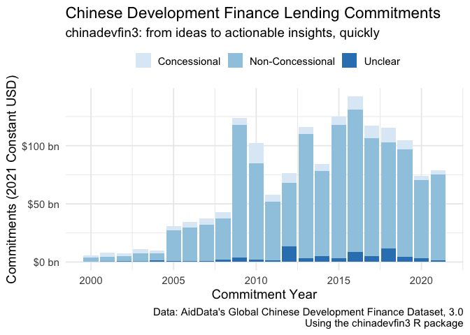

<!-- README.md is generated from README.Rmd. Please edit that file -->

# chinadevfin3

<!-- badges: start -->
<!-- badges: end -->

`chinadevfin3` is primarily a data package enabling an efficient method
for working with [AidData’s](https://www.aiddata.org/) [Global Chinese
Development Finance Dataset, Version
3.0](https://www.aiddata.org/data/aiddatas-global-chinese-development-finance-dataset-version-3-0)
(GCDF 3.0) in R.

### About the GCDF 3.0 dataset:

[AidData’s](https://www.aiddata.org/data/aiddatas-global-chinese-development-finance-dataset-version-3-0)
summary of the dataset:

> This uniquely comprehensive and granular dataset captures 20,985
> projects across 165 low- and middle-income countries supported by
> loans and grants from official sector institutions in China worth
> \$1.34 trillion. It tracks projects over 22 commitment years
> (2000-2021) and provides details on the timing of project
> implementation over a 24-year period (2000-2023). An accompanying
> report, Belt and Road Reboot: Beijing’s Bid to De-Risk Its Global
> Infrastructure Initiative, analyzes the dataset and provides
> myth-busting evidence about the changing nature, scale, and scope of
> China’s overseas development program.

Please see the
[AidData’s](https://www.aiddata.org/data/aiddatas-global-chinese-development-finance-dataset-version-3-0)
dataset website for full citation details.

If you are unfamiliar with the dataset, the following resources are a
great place to start:

- **AidData - Policy Report**: [Belt and Road Reboot: Beijing’s Bid to
  De-Risk Its Global Infrastructure
  Initiative](https://www.aiddata.org/publications/belt-and-road-reboot)
- **AidData - Methodology**: [Tracking Underreported Financial Flows
  (TUFF) Methodology,
  3.0](https://www.aiddata.org/publications/aiddata-tuff-methodology-version-3-0).
- **AidData - Dataset Website**: [Global Chinese Development Finance
  Dataset, Version
  3.0](https://www.aiddata.org/data/aiddatas-global-chinese-development-finance-dataset-version-3-0)

### Relevant Notes

1.  **`chinadevfin3` is still under heavy development**: Please use
    accordingly. The initial phase of package development aims to
    finalize stable versions of the datasets, and will be announced with
    a new package version release and note. Further development will
    focus on building helper functions to aid efficient analysis
    workflows with the dataset.
2.  **`chinadevfin3` is a personal project**: While the package author
    works as a [consultant to
    AidData](https://www.linkedin.com/feed/update/urn:li:activity:7067478837885849600/)
    this package is a personal project with no official affiliation or
    sponsorship from AidData. The author built the package for his own
    own use, but hopes that it can grow into a robust package that can
    aid researchers, policymakers, and others interested in gaining
    actionable, empirically-based insights about Chinese development
    finance lending using the GCDF 3.0 dataset.

## Installation

You can install `chinadevfin3` from [GitHub](https://github.com/) with:

``` r
# install the `devtools` package if not yet installed
# install.packages("devtools")

#devtools::install_github("t-emery/chinadevfin3")
```

This package will never be published on
[CRAN](https://cran.r-project.org/) because the data file sizes are too
big.

## Example

The core initial functionality of `chinadevfin3` is to load the GCDF 2.0
dataset as a `tibble` using `get_gcdf2_dataset()`:

``` r
# load the chinadevfin3 library
library(chinadevfin3)
library(tidyverse)
#> Warning: package 'ggplot2' was built under R version 4.3.1
#> Warning: package 'dplyr' was built under R version 4.3.1
#> ── Attaching core tidyverse packages ──────────────────────── tidyverse 2.0.0 ──
#> ✔ dplyr     1.1.4     ✔ readr     2.1.4
#> ✔ forcats   1.0.0     ✔ stringr   1.5.0
#> ✔ ggplot2   3.4.4     ✔ tibble    3.2.1
#> ✔ lubridate 1.9.2     ✔ tidyr     1.3.0
#> ✔ purrr     1.0.2     
#> ── Conflicts ────────────────────────────────────────── tidyverse_conflicts() ──
#> ✖ dplyr::filter() masks stats::filter()
#> ✖ dplyr::lag()    masks stats::lag()
#> ℹ Use the conflicted package (<http://conflicted.r-lib.org/>) to force all conflicts to become errors

# Load the GCDF 2.0 dataset as a tibble, with standardized country names added at the beginning.
get_gcdf3_dataset()
#> # A tibble: 20,985 × 129
#>    country_name iso3c country_or_regional aid_data_record_id
#>    <chr>        <chr> <chr>                            <int>
#>  1 Afghanistan  AFG   country                          94556
#>  2 Afghanistan  AFG   country                          94564
#>  3 Afghanistan  AFG   country                          94565
#>  4 Afghanistan  AFG   country                          94567
#>  5 Afghanistan  AFG   country                          94568
#>  6 Afghanistan  AFG   country                          94613
#>  7 Afghanistan  AFG   country                          94619
#>  8 Afghanistan  AFG   country                          95312
#>  9 Afghanistan  AFG   country                          95322
#> 10 Afghanistan  AFG   country                          95323
#> # ℹ 20,975 more rows
#> # ℹ 125 more variables: recommended_for_aggregates <chr>,
#> #   aid_data_parent_id <chr>, umbrella <chr>, financier_country <chr>,
#> #   recipient <chr>, recipient_iso_3 <chr>, recipient_region <chr>,
#> #   commitment_year <int>, implementation_start_year <int>,
#> #   completion_year <int>, title <chr>, description <chr>,
#> #   staff_comments <chr>, status <chr>, intent <chr>, flow_type <chr>, …
```

`gcdf3_data_dictionary` contains AidData’s detailed data definitions for
all of the GCDF 2.0 variables:

``` r
# Load the GCDF 2.0 data dictionary as a tibble
gcdf3_data_dictionary
#> # A tibble: 126 × 4
#>    column_name                column_class field_name                description
#>    <chr>                      <chr>        <chr>                     <chr>      
#>  1 aid_data_record_id         integer      AidData Record ID         "This fiel…
#>  2 recommended_for_aggregates character    Recommended For Aggregat… "This fiel…
#>  3 aid_data_parent_id         character    AidData Parent ID         "This fiel…
#>  4 umbrella                   character    Umbrella                  "This fiel…
#>  5 financier_country          character    Financier Country         "This fiel…
#>  6 recipient                  character    Recipient                 "This fiel…
#>  7 recipient_iso_3            character    Recipient ISO-3           "This fiel…
#>  8 recipient_region           character    Recipient Region          "This fiel…
#>  9 commitment_year            integer      Commitment Year           "This fiel…
#> 10 implementation_start_year  integer      Implementation Start Year "This fiel…
#> # ℹ 116 more rows
```

This makes it easy to find actionable insights quickly. Let’s look at
the growth of concessional versus non-concessional lending in the years
covered by the dataset (2000-2021).

``` r

concessional_vs_non_concenssional <- get_gcdf3_dataset() |> 
  # See `recommended_for_aggregates` in the gcdf2_data_dictionary to learn more about this. 
  filter(recommended_for_aggregates == "Yes") |> 
  # Group by the commitment year and whether the flow class
  group_by(commitment_year, flow_class) |> 
  # Find the sum by year and concessionality type in constant 2021 USD
  summarize(commitments = sum(amount_constant_usd_2021, na.rm = TRUE)) |> 
  # # ungroup to avoid strange side effects of grouped tibbles
  ungroup() |> 
  # make prettier names for a chart or table
  mutate(label_for_chart = case_when(flow_class == "ODA-like" ~ "Concessional",
                                     flow_class == "OOF-like" ~ "Non-Concessional",
                                     flow_class == "Vague (Official Finance)" ~ "Unclear",
                                     ))
#> `summarise()` has grouped output by 'commitment_year'. You can override using
#> the `.groups` argument.

concessional_vs_non_concenssional
#> # A tibble: 66 × 4
#>    commitment_year flow_class               commitments label_for_chart 
#>              <int> <chr>                          <dbl> <chr>           
#>  1            2000 ODA-like                 1444567415. Concessional    
#>  2            2000 OOF-like                 3991855049. Non-Concessional
#>  3            2000 Vague (Official Finance)   12832284. Unclear         
#>  4            2001 ODA-like                 3497419010. Concessional    
#>  5            2001 OOF-like                 4164166662. Non-Concessional
#>  6            2001 Vague (Official Finance)  203504588. Unclear         
#>  7            2002 ODA-like                 2266910083. Concessional    
#>  8            2002 OOF-like                 4887766447. Non-Concessional
#>  9            2002 Vague (Official Finance)  428586041. Unclear         
#> 10            2003 ODA-like                 3523472591. Concessional    
#> # ℹ 56 more rows
```

Now we can use `ggplot2` to make a data visualization:

``` r
concessional_vs_non_concenssional |> 
  ggplot(aes(x = commitment_year, y = commitments, fill = label_for_chart)) +
  geom_bar(stat = "identity") +
  scale_fill_brewer(palette = "Blues") +
  theme_minimal(base_size = 14) +
  scale_y_continuous(labels = scales::label_dollar(suffix = " bn", scale = 1/10^9, accuracy = 1)) +
  labs(title = "Chinese Development Finance Lending Commitments",
       subtitle = "chinadevfin3: from ideas to actionable insights, quickly",
       x = "Commitment Year",
       y = "Commitments (2021 Constant USD)",
       fill = "",
       caption = "Data: AidData's Global Chinese Development Finance Dataset, 3.0\nUsing the chinadevfin3 R package") +
  theme(legend.position="top")
```


